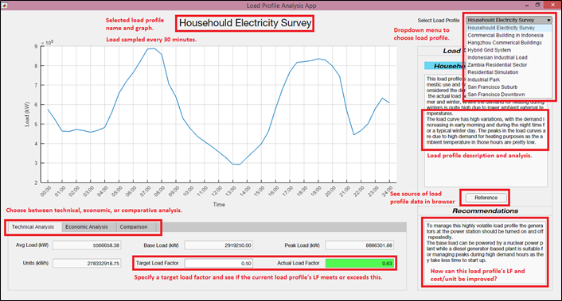

# Power Generation CEP: Generating Station Design
Generating station costing and design for load profiles of 10 real-world load profiles. 

Prepared as a Complex Engineering Problem (CEP)-based end-of-semester project for EE-411 Power Generation (Fall 2019) as part of BE-Electrical Engineering at NEDUET. 

## Group Members
|Roll Number|Name|
|:-------:|:------|
|EE-163|Saad Siddiqui|
|EE-164|Faiq Siddiqui|
|EE-084|Aymen Batool|
|EE-171|Malik Zain-ul-Hassan|

## Deliverables
1. [MATLAB GUI application](./pg-app/PG_App.mlapp) for the technical and economic analysis of 10 real-world load profiles. 

2. 3D models of proposed generating station designs for 2 load profiles presented in the MATLAB application.
	- [Nuclear Power Station Design](https://skfb.ly/6PT9R)
	- [Diesel Power Station Design](https://skfb.ly/6PTtZ)
 
3. A [project report](./pg-cep-report.pdf) summarising findings and design recommendations.