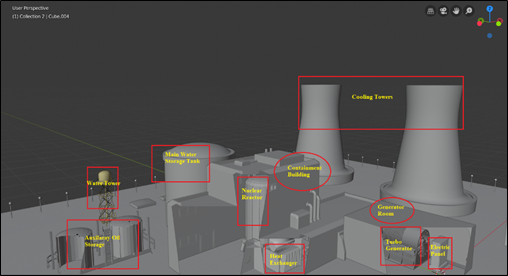

# Power Generation CEP: Generating Station Design
Generating station costing and design for load profiles of 10 real-world load profiles. 

Prepared as a Complex Engineering Problem (CEP)-based end-of-semester project for EE-411 Power Generation (Fall 2019) as part of BE-Electrical Engineering at NEDUET. 

## Project Report
Details of the project are summarised in the [project report](./pg-cep-report.pdf).

## Group Members
|Roll Number|Name|
|:-------:|:------|
|EE-163|Saad Siddiqui|
|EE-164|Faiq Siddiqui|
|EE-084|Aymen Batool|
|EE-171|Malik Zain-ul-Hassan|

## Deliverables
### MATLAB GUI Application

- [A GUI application](./pg-app/PG_App.mlapp) for the technical and economic analysis of 10 real-world load profiles. Built with MATLAB App Designer R2014b.
- Loads and plots data for 10, real-world daily load profiles.
- Provides descriptions, reference to source of data, and recommendations to improve load factor for each load profile.
- Allows user to calculate
	- Technical Metrics: load factor, maximum load, base load, average load, units consumed.
	- Economic Metrics: Overall cost per unit generated (two-part or three-part)
- Also allows user to **compare** all load profiles in terms of both load factor and cost. 
- Launches 3D models of proposed generating station designs deployed on Sketchfab.

### Proposed Generating Station 3D Models

- Designed in Blender.
- Deployed on Sketchfab for platform-independent online viewing.
- Proposed designs are
	- [Nuclear Power Station Design](https://skfb.ly/6PT9R)
	- [Diesel Power Station Design](https://skfb.ly/6PTtZ)
- Designs account for 
	- generator dimensions and spacing requirements according to NEC and CAT standards.
	- transmission yard and relevant equipment.
	- fuel transportation and storage requirements. 
	- heat rejection and exhaust systems. 